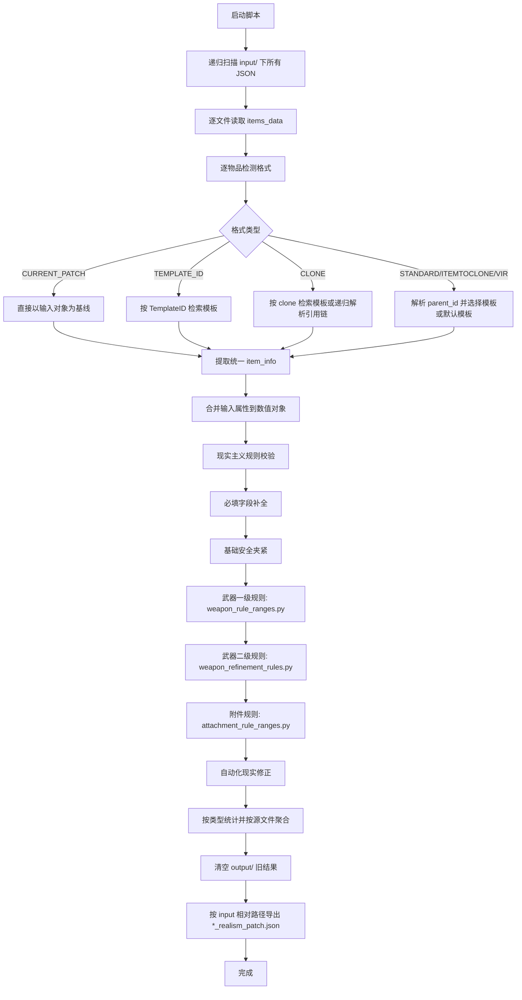

# EFT 现实主义数值生成器使用指南（v2.11）

本文用于快速上手 `generate_realism_patch.py`，并说明输入格式、规则配置与常见问题。

## 1. 工具作用

本工具会读取 `input/` 中的物品数据，结合 `现实主义物品模板/` 重建并生成 Realism 数值配置，并输出到 `output/`。

当前版本特性：

- 支持多种输入格式自动识别（`CURRENT_PATCH`、`STANDARD`、`CLONE`、`ITEMTOCLONE`、`VIR`、`TEMPLATE_ID`）。
- 输出仅按源文件保存，并保留 `input/` 的目录结构。
- 每次运行前自动清空 `output/`，避免旧结果干扰。
- 武器和附件规则范围支持独立配置文件维护。
- 支持武器二级细分修正（口径与枪托形态）。

## 2. 环境要求

- Python 3.8 及以上（建议使用项目内 `.venv`）。
- Windows 可直接使用 `现实主义数值生成器.bat`（文件名保留）。

## 3. 目录说明

关键目录和文件：

- `generate_realism_patch.py`: 主脚本。
- `input/`: 输入物品 JSON 数据。
- `output/`: 输出结果目录（运行时自动刷新）。
- `现实主义物品模板/`: 模板库。
- `weapon_rule_ranges.py`: 武器规则范围配置。
- `attachment_rule_ranges.py`: 附件规则范围配置。
- `weapon_refinement_rules.py`: 武器口径与枪托二级修正规则。

## 4. 快速开始

### 方式 A：双击批处理（推荐 Windows 用户）

1. 将待处理 JSON 放入 `input/`（支持子目录）。
2. 双击运行 `现实主义数值生成器.bat`。
3. 处理完成后，在 `output/` 查看结果。

### 方式 B：命令行运行

在项目根目录执行：

```powershell
.\.venv\Scripts\python.exe generate_realism_patch.py
```

## 5. 输入格式要求

脚本会自动识别以下格式：

1. `CURRENT_PATCH`
- 特征：包含 `$type` + `ItemID`。
- 说明：可直接对现有数值对象做重写和规则校验。

2. `STANDARD`
- 特征：包含 `parentId` 或 `itemTplToClone`。

3. `CLONE`
- 特征：包含 `clone` 字段。

4. `ITEMTOCLONE`
- 特征：包含 `ItemToClone` 字段。

5. `VIR`
- 特征：包含 `item`，且 `item` 下有 `_id`、`_parent`。

6. `TEMPLATE_ID`
- 特征：包含 `TemplateID` + `$type`。

## 6. 输出规则

- 输出根目录为 `output/`。
- 按源文件路径输出，目录结构与 `input/` 保持一致。
- 输出文件命名规则：`原文件名_realism_patch.json`。

示例：
- 输入：`input/attatchments/ScopeTemplates.json`
- 输出：`output/attatchments/ScopeTemplates_realism_patch.json`

## 7. 数值生成逻辑（核心流程）

### 7.1 流程图



脚本的数值生成遵循“识别 -> 构建 -> 合并 -> 校验 -> 导出”的流水线：

1. 递归扫描输入文件
- 递归读取 `input/` 下所有 JSON。
- 每个文件按“相对路径（去后缀）”作为源键，后续用于还原目录结构输出。

2. 逐物品识别数据格式
- 对每个物品自动识别格式：`CURRENT_PATCH`、`STANDARD`、`CLONE`、`ITEMTOCLONE`、`VIR`、`TEMPLATE_ID`。
- 不可识别或被 `enable=false` 禁用的物品会跳过。

3. 提取统一物品信息
- 提取 `item_id`、`parent_id`、`clone_id`、`template_id`、`name`、`properties`。
- 对字符串类型 `parentId`（如 `GAS_BLOCK`）先做标准化映射。

4. 构建数值基线
- `CURRENT_PATCH`：直接以输入对象为基线重写。
- `TEMPLATE_ID`：按 `TemplateID` 在模板库检索基线模板。
- `CLONE`：优先从模板库按 `clone` 查找；找不到时可递归解析同文件引用链。
- `STANDARD` / `ITEMTOCLONE` / `VIR`：先解析 `parent_id`，再按类型选择模板或默认模板。

5. 合并输入属性
- 输入文件中的属性（如 `overrideProperties` / `_props`）合并到数值对象。
- `Name`、可识别核心字段优先保留输入值；极敏感字段会避免被异常值硬覆盖。

6. 应用现实主义规则校验
- 先做必填字段补全（不同 `$type` 的最低字段要求）。
- 再做基础安全夹紧（如后坐、人体工学、重量等全局边界）。
- 武器：
- 先按 `weapon_rule_ranges.py` 的基础档位夹紧。
- 再按 `weapon_refinement_rules.py` 做口径 + 枪托二级修正。
- 附件：按 `attachment_rule_ranges.py` 的档位规则夹紧。
- 最后应用自动化现实修正（材质、尺寸、枪管长度推断等）。

7. 分类与按源文件聚合
- 物品会按 `$type` 进入武器/附件/子弹/装备/消耗品统计。
- 同时按“源文件键”聚合，准备导出。

8. 清理并导出
- 每次导出前先清空 `output/`。
- 再将每个源文件聚合结果导出到 `output/` 对应子目录。
- 最终输出文件名为 `原文件名_realism_patch.json`。

## 8. 如何调整规则范围

### 调整武器规则

编辑 `weapon_rule_ranges.py` 中的 `WEAPON_PROFILE_RANGES`：
- 如 `assault`、`pistol`、`smg`、`sniper`、`shotgun`。
- 每个字段使用 `(最小值, 最大值)` 形式。

### 调整附件规则

编辑 `attachment_rule_ranges.py` 中的 `MOD_PROFILE_RANGES`：
- 如 `muzzle_suppressor`、`foregrip`、`stock` 等。
- 每个字段使用 `(最小值, 最大值)` 形式。

修改后重新运行脚本即可生效。

## 9. 常见问题

1. 运行后输出为空
- 检查 `input/` 是否有合法 JSON。
- 检查输入是否包含可识别格式字段。

2. 部分物品被跳过
- 终端会打印 `跳过` 原因，通常是无法解析 `parent_id` 或找不到模板。

3. 输出结果和预期不一致
- 确认是否修改了 `weapon_rule_ranges.py` 或 `attachment_rule_ranges.py`。
- 确认输入中关键字段是否正确（如 `parentId`、`clone`、`ItemToClone`）。

4. 如何定位配置生效
- 先小范围修改一个规则区间。
- 运行后比对对应物品字段是否被夹紧到新范围。

## 10. 推荐维护流程

1. 先在 `input/` 放最小样本数据做验证。
2. 调整规则配置文件中的范围。
3. 运行脚本并检查 `output/` 对应文件。
4. 确认无误后再批量处理完整数据。
